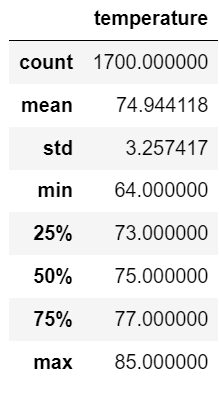
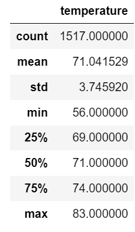

# Surfs_up Analysis 

## Overview of analysis

We would like to open up a new Surf and Ice Cream shop on the island of Oahu.  In order to 
see if this new proposal is viable we wanted to make sure the temperatures in June and 
December woud be vialbe for our shop to generate the business needed to sustain itself. 

## Our Results

We first checked on the weather temperatures for the month of June on the island of Oahu.

As we can the mean temperature for the month of June is 75 degrees with highs in the 
mid 80's.  Those kind of temperatures are perfect for surfing and ice cream.  That though
should be expected since this is the summer time for this part of the world.

December though is the time of year we need to make sure the temperatures will support
our ice cream so we pulled the same temperature data but for the month of December, when
winter starts  

We see here that our mean temperature in the month of December is in the low 70's.  Most 
importantly though it shows that in our 50% to 75% areas of temperature is between 71-74
degrees.  Along with that, our max temps for the month of December still hit 83 degrees.  
Anything in the that range would indicate great ice cream eating weather. 

## Summary

The temperatures for the two months we reviewed really showed no issues in terms of if the
weather would be warm enough for us to sell our ice cream at a good rate.  Even though 
the temperatures are in our favor it would be good to analyze our precipitation during
the same time periods to see when our rainy season is since if it's raining no one
will be surfing and ice cream sales would be done.  

I believe it would also be beneficial to review the month of February's data as this is
typically the coldest month in the Northern Hemispere as that could be our slowest month
and could be a challenge.  December should be a great month no matter what as people
from everywhere will still travel during the holidays to visit in December but February 
is more of a month for our residents.  
